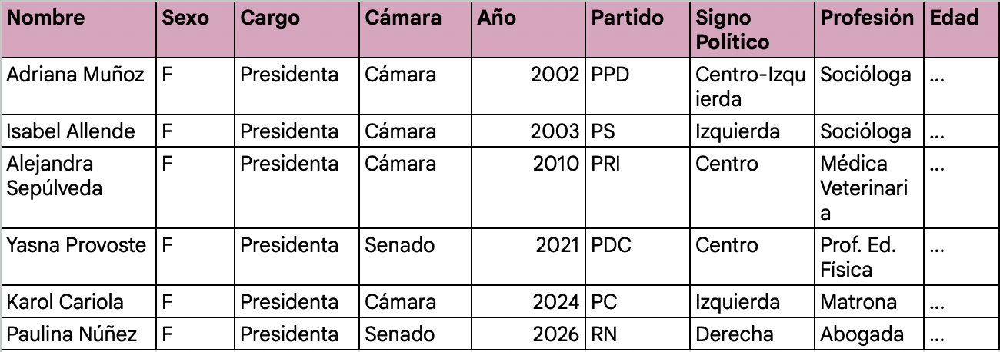

# DESCRIPCIÓN BASE DE DATOS

## Base de datos: Plan de construcción

No existe una base de datos con todos estos datos, por eso deberemos construir una propia. Esta base de datos se necesita para documentar el liderazgo femenino en las Mesas Directivas del Congreso Nacional de Chile desde el retorno a la democracia (1990) hasta el 2026.

**Autor y publicación:**  
Elaboración propia a partir de datos del Senado de Chile, la Cámara de Diputadas y Diputados, y las Reseñas Biográficas de la BCN.

---

## Contenido

- **Variables:** Nombre, Cargo, Cámara, Año, Partido Político, Signo Ideológico, Profesión, Edad al asumir.  
- **Periodo de levantamiento:** En 2026 recogimos los datos de las mujeres parte de las testeras de ambas cámaras entre 1990 - 2026.  
- **Pertinencia:** Esta base es vital porque permite cruzar la filiación política con la preparación profesional, siendo la única forma de probar fehacientemente la transversalidad y profesionalización planteada en la hipótesis.  

---

## Metodología

### Recolección

Inscripción manual a partir de los registros históricos de Wikipedia y los sitios oficiales de ambas cámaras para obtener nombres y años:

- **Senado:**  
  https://www.senado.cl/acerca-del-senado/antecedentes-historicos/historico-de-presidencias-y-vicepresidencias-del-senado  

- **Cámara de Diputadas y Diputados:**  
  https://www.camara.cl/camara/doc/mesas_historicas.pdf  

- **Wikipedia (referencia complementaria):**  
  https://es.wikipedia.org/wiki/Presidente_del_Senado_de_Chile  

---

### Enriquecimiento

Web scraping o búsqueda dirigida en el portal de la Biblioteca del Congreso Nacional (BCN) para completar los datos de profesión y trayectoria de cada nombre identificado.

---

### Clasificación

Asignación de signo político basado en la clasificación del sistema de partidos chileno:

- Derecha  
- Centro-Derecha  
- Centro  
- Centro-Izquierda  
- Izquierda  

---

### Almacenamiento / Ubicación

Las bases de datos se construirán y almacenarán en un drive compartido, a través de hojas de cálculo:

https://drive.google.com/drive/folders/1X_c4j8D8c_SYIuU8WkUg2RNa5vE-CJ6-?usp=sharing  

> *Nota: El contenido de las tablas no está completo aún.*

---

## Ejemplo de la base de datos

*(Base actualmente en construcción e incompleta)*
