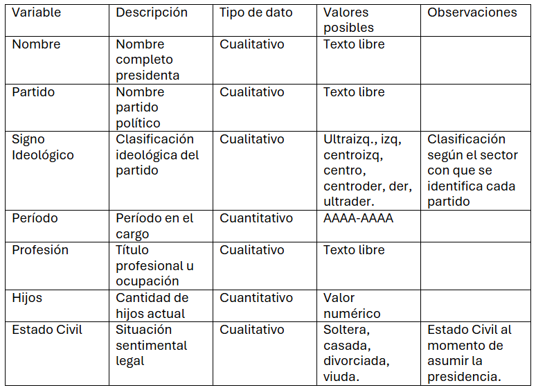

# Ficha técnica y diccionario de datos 
### Fuentes de los datos: Wikipedia, Biblioteca Nacional del Congreso de Chile y Registro Civil 

Para contar con una base de datos multidimensional que represente a las mujeres que han ejercido cargos de presidencia en partidos políticos en Chile se realizó una construcción manual de una base de datos mediante recolección de información desde Wikipedia, Reseñas biográficas parlamentarias de la página de la Biblioteca Nacional del Congreso de Chile y certificados obtenidos en la página del Registro Civil. 

Se obtuvieron nombres, períodos y partidos políticos mediante una base de datos de Wikipedia los cuales se reestructuraron en una base nueva que incluye las variables de: signo político del partido, cantidad de hijos de cada presidenta y su estado civil al asumir el cargo. 

Estos datos restantes se recolectaron a través de un barrido manual por las bibliografías parlamentarias de la mayoría de las presidentas en la Biblioteca Nacional del Congreso, prensa y pestañas bibliográficas de Wikipedia. 

La base de datos contempla los últimos 37 años porque la primera presidenta de un partido político en Chile ocupó ese cargo en 1989. Incluye todos los partidos que hayan tenido una presidenta desde ese entonces hasta el 2026. Con el fin de complejizar el análisis decidí agregar las variables Hijos y Estado Civil.  
# Diccionario de datos
